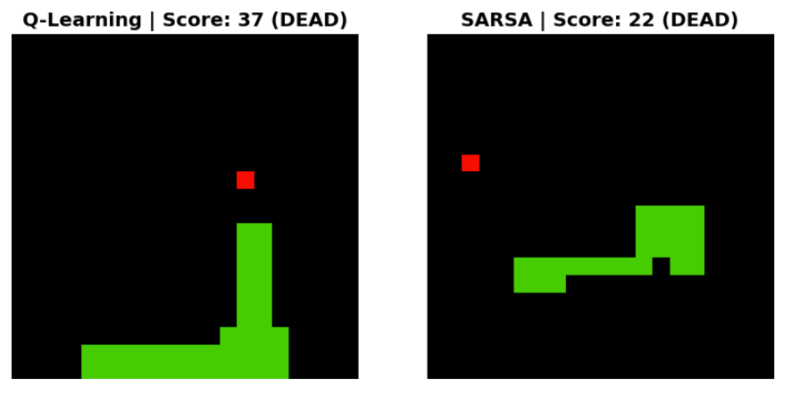

# 🐍 Snake Intelligence Lab — Multi-Algorithm RL Benchmarks

[](https://www.python.org/)
[](https://pytorch.org/)
[](https://gymnasium.farama.org/)
[]()

This project solves the classic Snake game using **four Reinforcement Learning algorithms** and provides a comprehensive comparison framework including hyperparameter sweeps and reward shaping ablation.


*Side-by-side comparison of trained Q-Learning and SARSA agents.*

## 🚀 Final Deliverables
- **[Final Presentation Notebook (Executed)](Snake_RL_Multi_Algorithm_Comparison_donerun.ipynb)**: The complete project in a single, self-contained, and fully executed Jupyter Notebook.
- **[Project Research & Development Notes](NOTES.md)**: Detailed breakdown of insights, architecture decisions, and experimental logs.
- **[Video Presentation Script](_presentation_script.md)**: The English/Mandarin script guide for the final 3-5 minute summary video.

## Algorithms Implemented

| Algorithm | Type | File | Method |
|-----------|------|------|--------|
| **Tabular Q-Learning** | Value-based, Off-policy | `src/tabular_q.py` | Q-table (2048 states) |
| **SARSA** | Value-based, On-policy | `src/tabular_sarsa.py` | Q-table (on-policy update) |
| **DQN** | Value-based, Off-policy | `src/train_dqn.py` | Neural Network (Stable-Baselines3) |
| **PPO** | Policy Gradient, On-policy | `src/train_ppo.py` | Actor-Critic (Stable-Baselines3) |

## Setup

```bash
# 1. Activate virtual environment
source venv/bin/activate

# 2. Install dependencies
pip install -r requirements.txt
```

## Training Individual Algorithms

```bash
# Tabular Q-Learning (baseline)
python src/tabular_q.py --episodes 5000

# SARSA
python src/tabular_sarsa.py --episodes 5000

# DQN (uses MPS GPU acceleration on Apple Silicon)
python src/train_dqn.py --timesteps 300000

# PPO
python src/train_ppo.py --timesteps 300000
```

All scripts support `--reward_shaping` to enable distance-based reward shaping.

## 🔬 Hyperparameter Sweep

Automated sweep over learning rate (α), discount factor (γ), and ε-decay.  
Outputs a CSV file and a heatmap visualization.

```bash
python src/hyperparameter_sweep.py --episodes 1000
```

**Output:**
- `results/hyperparameter_sweep_results.csv` — full results table
- `results/figures/hyperparameter_heatmap.png` — visual heatmap of best configurations

## 📊 Full Algorithm Comparison (One Command!)

Trains all algorithms and generates a **publication-quality 4-panel figure**:

```bash
python src/compare_algorithms.py
```

**Output (`results/figures/algorithm_comparison.png`):**
- (a) Learning curves for all 5 variants
- (b) Bar chart: final average performance
- (c) Reward shaping ablation study
- (d) Score distribution box plot

## 🎮 Watch Trained Agents Play

```bash
python src/evaluate.py --algo tabular          # Q-Learning
python src/evaluate.py --algo sarsa            # SARSA
python src/evaluate.py --algo dqn              # DQN
python src/evaluate.py --algo ppo              # PPO
python src/evaluate.py --algo tabular --num_games 10  # Run 10 games
```

## 📈 TensorBoard

```bash
tensorboard --logdir logs/dqn_tensorboard/   # DQN logs
tensorboard --logdir logs/ppo_tensorboard/   # PPO logs
```

## Project Structure

```
project/
├── src/                                # All source code
│   ├── _paths.py                       # Shared path constants
│   ├── snake_env.py                    # Custom Gymnasium Snake environment (11-dim state)
│   ├── tabular_q.py                    # Tabular Q-Learning implementation
│   ├── tabular_sarsa.py                # SARSA implementation
│   ├── train_dqn.py                    # DQN training (Stable-Baselines3)
│   ├── train_ppo.py                    # PPO training (Stable-Baselines3)
│   ├── compare_algorithms.py           # Full comparison: 4-panel figure + stats table
│   ├── evaluate.py                     # Pygame visualization for any trained agent
│   └── hyperparameter_sweep.py         # Automated α/γ/ε sweep + heatmap
├── results/
│   ├── models/                         # Trained model files (.pkl, .zip)
│   └── figures/                        # Generated plots (.png)
├── logs/                               # TensorBoard & training logs
├── requirements.txt
├── README.md
├── [NOTES.md](NOTES.md)
└── [Snake_RL_Multi_Algorithm_Comparison_donerun.ipynb](Snake_RL_Multi_Algorithm_Comparison_donerun.ipynb)
```
